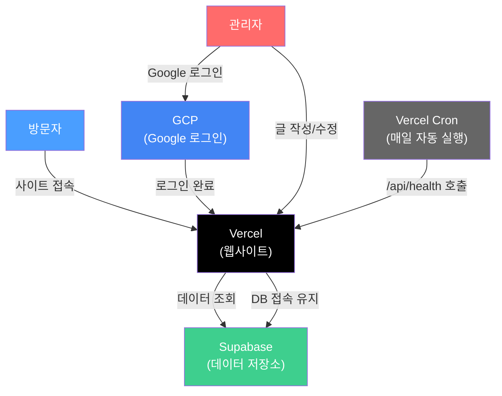

# 서비스 구성 및 관리 가이드

이 문서는 포트폴리오 웹사이트를 구성하는 서비스들의 역할과 관리 방법을 설명합니다.

## 1. 전체 구성도

**흐름 요약:**
- **방문자**가 사이트에 접속하면 → Vercel이 웹페이지를 보여주고 → Supabase에서 데이터를 가져옵니다
- **관리자**가 글을 관리하려면 → Google 로그인(GCP) → 관리자 페이지에서 작업
- **Cron(자동 작업)**이 매일 Supabase에 접속하여 데이터베이스가 꺼지지 않게 유지합니다

---

## 2. 서비스별 역할과 대시보드

### 2-1. Vercel — 웹사이트가 돌아가는 곳

웹사이트를 인터넷에 공개하고, 코드가 변경되면 자동으로 새 버전을 배포합니다.

| 항목 | 설명 |
|------|------|
| **대시보드** | [vercel.com/dashboard](https://vercel.com/dashboard) → 프로젝트 클릭 |
| **환경변수 확인/수정** | Settings 탭 → Environment Variables |
| **배포 기록** | Deployments 탭에서 모든 배포 이력 확인 |
| **도메인 설정** | Settings → Domains |
| **빌드 로그** | Deployments → 특정 배포 클릭하면 상세 로그 확인 |
| **Cron 설정** | 프로젝트 내 `vercel.json` 파일에서 관리 (매일 오전 9시 UTC) |

### 2-2. Supabase — 데이터가 저장되는 곳

글, 카테고리, 이미지 등 모든 데이터를 저장하고 관리합니다. Google 로그인 인증도 처리합니다.

| 항목 | 설명 |
|------|------|
| **대시보드** | [supabase.com/dashboard](https://supabase.com/dashboard) → 프로젝트 클릭 |
| **API 키 확인** | Project Settings → API Keys |
| **레거시 키 (anon/service_role)** | API Keys → Legacy API Keys 탭 |
| **프로젝트 URL** | Connect 버튼 또는 API Keys 페이지에서 확인 |
| **테이블 확인/편집** | Table Editor (왼쪽 메뉴) |
| **인증 설정** | Authentication → Providers |
| **Google 로그인 설정** | Authentication → Providers → Google 선택 |
| **이미지 저장소** | Storage → Buckets |
| **SQL 편집기** | SQL Editor (왼쪽 메뉴) |

### 2-3. GCP — Google 로그인 설정

관리자가 Google 계정으로 로그인할 수 있도록 OAuth(인증) 설정을 관리합니다.

| 항목 | 설명 |
|------|------|
| **콘솔** | [console.cloud.google.com](https://console.cloud.google.com) |
| **OAuth 클라이언트 확인** | Auth Platform → Clients |
| **Client ID / Secret 확인** | Clients → 해당 클라이언트 클릭 |
| **리디렉션 URI 수정** | 클라이언트 상세 → Authorized redirect URIs |
| **동의 화면 설정** | Auth Platform → Branding |

---

## 3. 환경변수 정리

환경변수는 서비스들을 연결하는 비밀 설정값입니다. Vercel 대시보드에서 확인하고 수정할 수 있습니다.

| 환경변수 | 설명 | 확인 위치 |
|----------|------|-----------|
| `NEXT_PUBLIC_SUPABASE_URL` | Supabase 프로젝트 주소 | Supabase 대시보드 → Project Settings → API Keys → Project URL |
| `NEXT_PUBLIC_SUPABASE_ANON_KEY` | Supabase 공개 키 | Supabase 대시보드 → Project Settings → API Keys → Legacy API Keys → `anon` `public` |
| `ADMIN_EMAIL` | 관리자 이메일 주소 | 직접 설정한 Google 계정 이메일 |

**환경변수 수정 방법:**
1. [Vercel 대시보드](https://vercel.com/dashboard)에서 프로젝트 선택
2. Settings 탭 → Environment Variables
3. 수정할 변수 옆의 편집 버튼 클릭
4. 값 수정 후 저장
5. 변경 사항을 적용하려면 재배포 필요 (Deployments 탭 → 가장 최근 배포 → Redeploy)

---

## 4. 관리자 페이지 사용법

### 접속 방법

1. 웹브라우저에서 `사이트주소/auth/login` 입력
2. "Google로 로그인" 버튼 클릭
3. `ADMIN_EMAIL`에 설정된 Google 계정으로 로그인
4. 로그인 성공 시 자동으로 관리자 페이지(`/admin`)로 이동

> **참고:** 로그인하지 않은 상태에서 `/admin`에 직접 접속하면 "페이지를 찾을 수 없습니다(404)" 화면이 표시됩니다. 반드시 `/auth/login`에서 먼저 로그인하세요.

### 할 수 있는 작업

| 작업 | 방법 |
|------|------|
| **글 작성** | 관리자 페이지 → "새 글 작성" → 제목, 카테고리, 내용 입력 → 저장 |
| **글 수정** | 글 목록에서 수정할 글 클릭 → 내용 수정 → 저장 |
| **글 삭제** | 글 목록에서 삭제할 글의 삭제 버튼 클릭 |
| **카테고리 관리** | 카테고리 관리 메뉴에서 추가/수정/삭제/순서 변경 |
| **사이트 정보 수정** | 사이트 콘텐츠 관리 메뉴에서 이름, 소개글, 연락처 수정 |

---

## 5. 비용 정보

현재 모든 서비스를 **무료 플랜**으로 사용하고 있습니다.

| 서비스 | 무료 한도 | 초과 시 |
|--------|-----------|---------|
| **Vercel** | 월 100GB 대역폭 | 유료 플랜 업그레이드 필요 |
| **Supabase** | DB 500MB, 스토리지 1GB | 유료 플랜 업그레이드 필요 |
| **GCP** | OAuth 무료 | 비용 없음 |

개인 포트폴리오 규모에서는 무료 한도를 초과할 가능성이 거의 없습니다.

---

## 6. 자동 유지 관리 (Supabase 종료 방지)

### 왜 필요한가?

Supabase 무료 플랜은 **1주일 동안 접속이 없으면 데이터베이스를 자동으로 일시 중지**합니다.
중지되면 사이트에서 데이터가 표시되지 않습니다.

### 어떻게 방지하고 있나?

Vercel의 Cron(예약 작업) 기능을 사용하여 **매일 오전 9시(UTC)**에 자동으로 데이터베이스에 접속합니다.
이 접속 덕분에 "비활동" 상태가 되지 않아 중지를 방지합니다.

- 설정 파일: 프로젝트 내 `vercel.json`
- 접속 경로: `/api/health`
- 별도로 관리할 필요 없음 (Vercel이 자동 실행)

### 만약 중지되었다면?

1. [Supabase 대시보드](https://supabase.com/dashboard) 접속
2. 프로젝트 선택
3. **Resume** 버튼 클릭
4. 몇 분 후 자동 복구됨

---

## 7. 문제 발생 시 확인 순서

### 사이트에 접속이 안 될 때

1. [Vercel 대시보드](https://vercel.com/dashboard) → 프로젝트 → Deployments 탭
2. 가장 최근 배포가 "Ready" 상태인지 확인
3. "Error"가 있다면 해당 배포를 클릭하여 로그 확인

### 데이터(글, 카테고리)가 표시되지 않을 때

1. [Supabase 대시보드](https://supabase.com/dashboard) → 프로젝트 상태 확인
2. "Paused"로 표시되면 Resume 버튼 클릭
3. Table Editor에서 데이터가 있는지 확인

### 로그인이 안 될 때

1. `ADMIN_EMAIL` 환경변수에 설정된 이메일로 로그인하고 있는지 확인
2. [GCP 콘솔](https://console.cloud.google.com) → Auth Platform → Clients
3. 리디렉션 URI가 올바른지 확인 (사이트 주소가 포함되어야 함)

### 어떤 문제든 해결이 어려울 때

Claude Code를 실행하고 상황을 설명하면 도움을 받을 수 있습니다.
사용 방법은 [Claude Code 사용 가이드](CLAUDE_CODE_GUIDE.md)를 참고하세요.
